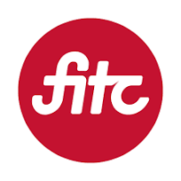

## Seneca Polytechnic
- *Teacher Assistant* | Sept'23 - Present
- 
- Tags: All Seneca Polytechnic
- Badges:
  - C/C++ [orange]
  - Teaching [green]
  - In-progress [yellow]
- List Items:
  - Assist professors with conducting tutorials and lab sessions, increasing average mark in two courses to ~70%
  - Helped students to reinforce their understanding of core course concepts, including demonstrating practical skills using C and C++ languages and facilitating discussions

## Web Unleashed 23
- *Volunteer - Performer Support* | Oct'23
- 
- Tags: All FITC
- Badges:
  - Volunteering [green]
  - Communication skills [blue]
  - Problem-solving skills [blue]
- List Items:
  - Played a vital role in supporting speakers during a Web Unleashed conference, ensuring their needs were met and presentations and workshops ran smoothly
  - Provided technical assistance, and offered on-site support to speakers, contributing to the overall success of the conferences
  - Demonstrated strong communication and problem-solving skills, fostering a positive and efficient environment for presenters