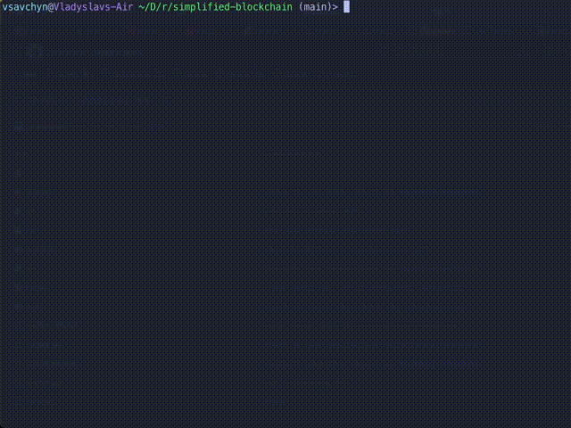

## Metropolian Museum
Full-stack web app that fetches data from Metropolitan API to check their exhibits!
- 
- Tags: Web Dev
- Badges:
  - NextJS/ReactJS [orange]
  - ExpressJS [orange]
  - MySQL [orange]
  - MongoDB [orange]
- Buttons:
  - Visit Website [https://next-museum-ruby.vercel.app]
  - GitHub(front-end) [https://github.com/vsavchyn-dev/NEXT_MUSEUM]
  - GitHub(back-end) [https://github.com/vsavchyn-dev/user_api]

## Mesmerizing shader
This shader creates an interesting scene that reacts to mouse movement. What're you waiting for? Check it out by clicking the button below!
- 
- Tags: Game Dev, Graphic Programming
- Badges:
  - OpenGL [orange]
  - Raycasting [red]
  - Graphic Programming [blue]
- Buttons:
  - ShaderToy [https://www.shadertoy.com/view/XcS3zy]

## Simplified blockchain
This project is a simple implementation of a blockchain using C++. I've implemented key features, like Block/Blockchain creation & validation.
- 
- Tags: Software Development
- Badges:
  - C++17 [orange]
  - C++20 [orange]
  - CMake [orange]
  - vcpkg [orange]
  - Blockchain [red]
  - Data Structures [red]
  - Software Development [blue]
- Buttons:
  - GitHub [https://github.com/vsavchyn-dev/blockchain]